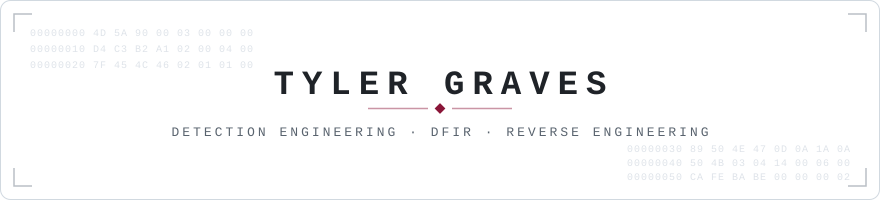

  <picture>
    <source media="(prefers-color-scheme: dark)" srcset="assets/header-dark.svg">
    <source media="(prefers-color-scheme: light)" srcset="assets/header-light.svg">
    
  </picture>

  Defensive security tooling you can verify, built for researchers and small teams.

  Boise, Idaho &nbsp;&middot;&nbsp;
  <a href="https://www.linkedin.com/in/tyler-graves-security">LinkedIn</a>

  
  
  
  

  <picture>
    <source media="(prefers-color-scheme: dark)" srcset="assets/divider-dark.svg">
    <source media="(prefers-color-scheme: light)" srcset="assets/divider-light.svg">
    
  </picture>

I work close to the metal: reverse engineering, malware analysis, and detection engineering. The projects here turn raw signal (packet captures, mail headers, unknown binaries, AI-agent logs) into something an analyst can act on. They're built for researchers and small security teams without a vendor budget behind them, and each one includes a way to verify its output instead of trusting it.

### Projects

#### Detection Engineering

**[Sigma-Forge](https://github.com/NotACop38/Sigma-Forge)** compiles Sigma rules into Splunk SPL and Microsoft Sentinel KQL, fire-tests each rule in CI, and maps coverage to MITRE ATT&CK and ATLAS. There's also a detection pack for LLM and AI-app threats.
 `Python` &middot; `Sigma` &middot; `Splunk SPL` &middot; `Sentinel KQL` &middot; `CI`

**[PromptHound](https://github.com/NotACop38/PromptHound)** is a detection library for attacks on LLM apps and AI agents, written to drop into a SIEM. The Sigma rules convert to SPL and KQL, map to the OWASP LLM Top 10 and MITRE ATLAS, and come with a synthetic telemetry generator that exercises every rule offline.
 `Python` &middot; `OWASP LLM Top 10` &middot; `MITRE ATLAS` &middot; `detection-as-code`

**[SubStation](https://github.com/NotACop38/SubStation)** is detection content for industrial-protocol attacks (Modbus, DNP3, Siemens S7), mapped to MITRE ATT&CK for ICS. A bundled traffic simulator emits benign and anomalous telemetry as PCAP and JSON, so you can test OT detections without a PLC or live hardware.
 `Python` &middot; `Modbus / DNP3 / S7` &middot; `ATT&CK for ICS` &middot; `PCAP`

#### Digital Forensics &amp; Incident Response

**[Casebound](https://github.com/NotACop38/Casebound)** is a local-first DFIR assistant that builds a verified forensic timeline and writes the case narrative from it. Every AI claim has to cite a real event or it gets rejected, so nothing in the report is invented.
 `DFIR` &middot; `local-first` &middot; `timeline analysis` &middot; `evidence-grounded AI`

**[PhishBowl](https://github.com/NotACop38/PhishBowl)** is a self-hosted phishing triage tool. It parses a suspicious `.eml` or `.msg`, defangs the IOCs, enriches them with OSINT, and writes a report with a risk score you can trace back to the evidence. Nothing gets sent, opened, or detonated.
 `Python` &middot; `email forensics` &middot; `OSINT` &middot; `IOC enrichment`

#### Reverse Engineering &amp; Tooling

**[Sextant](https://github.com/NotACop38/Sextant)** is a Rust CLI that works out the structure of unknown binary formats and network protocols from sample files, then generates parsers for Kaitai Struct, ImHex, Wireshark (Lua dissector), and 010 Editor, plus an annotated field map and a confidence report. The Rust engine tests every LLM-proposed refinement against the samples and keeps it only if the parse score improves.
 `Rust` &middot; `binary analysis` &middot; `protocol RE` &middot; `parser generation`

  <picture>
    <source media="(prefers-color-scheme: dark)" srcset="assets/divider-dark.svg">
    <source media="(prefers-color-scheme: light)" srcset="assets/divider-light.svg">
    
  </picture>

  
    <b>Detection &amp; SIEM</b>&nbsp;&nbsp;Splunk Enterprise Security (SPL) &middot; Microsoft Sentinel (KQL) &middot; Microsoft Defender &middot; Sigma 
    <b>Automation &amp; SOAR</b>&nbsp;&nbsp;Cortex XSOAR &middot; Python &middot; PowerShell 
    <b>Languages</b>&nbsp;&nbsp;Rust &middot; C &middot; x86 Assembly &middot; Python &middot; PowerShell 
    <b>Frameworks &amp; Taxonomies</b>&nbsp;&nbsp;MITRE ATT&amp;CK &middot; MITRE ATLAS &middot; ATT&amp;CK for ICS &middot; OWASP LLM Top 10
  

  Each project has its own way to check the output: rules fire-tested in CI, synthetic telemetry, validation against real samples, and reports you can audit.

